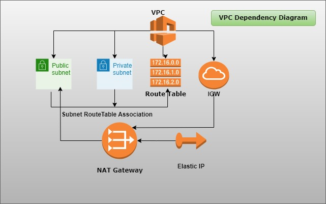

# Agenda: 3Tier Architecture Analysis & Requirements
# 3 Tier Architecture

* Setting up the environment
* Discuss terraform advantages and should we use terraform
* 3Tier architecture

* Realtime assignment
- To deploy one 3Tier architecture application into Cloud environemnt
- Entire project should be created by IAC (Terraform)
======================================================================

# Workout:
# Session-02: Creating a VPC

This session is about creating VPC through Terraform. One should have basic knowledge of VPC.

Below is the dependency diagram for better understanding.

* First we create VPC.
* Create Subnets. Public and Private into the above VPC.
* Create Internet Gateway.
* Attach Internet Gateway to VPC.
* Create Route Tables. Usually public and private. Route table will have automatic route of VPC.
* Associate route tables with subnets.
* Create EIP. Here elastic IP is independent resource.
* Create NAT gateway. NAT gateway has explicit dependency on Internet Gateway.

*** 3Tier Architecture Workflow ***

#  Generally in web application we've 3Tiers:

# Frontend
* Frontend website contains (HTML, JS)
- Frontend web takes the data from us, like (username, password, or create new account and account info, cart info or something else) 
- It'll gather all these details and send it to backend website

# Backend
* Backend website
- Contains (Java, PHP, Python, .Net, NodeJs) 

# Database
* Database Tier > Where all users & transactions data resides

* Finally:
- Frontend sends the requests to the Backend, then these Backend websites connects to the Database.

* For Example:
- If you're signing up for the first time and this Frontend took all details & send this details to backend,
  and this Backend will do some validations (Is this persone exists in our Database? If it exists it'll throw the error, Whether Mobile No. & EmailID are valid or not?) 

  If doesn't exists, it'll go and save the user and create the account and sends response to the Frontend that user creation is successful!

  This is called 3Tier application. 

  Also using Java we can do Frontend/Backend 

  * We connected Frontend & Backend through the API 
  * Frontend receives the details & send it to the Backend and then Backend will respond
  * This is the 3Tier Architecture.

  > Frontend Tier/Web Tier
  > Backend Tier/App Tier/Middleware
  > Database Tier 

Infront We've something called as,

> LoadBalancer
- Balances the Load

* LoadBalancer
- We consider this LoadBalancer into Webtier/Frontend Tier 

# 3Tier Website:
- When you hit this website, it'll show you the time. The time you get will be fetched from Database.

* Frontend              Backend                  Database
* nodeJS<--------------->nodeJS----------------->Postgres       
*                                                  time

* This is the 3Tier Architecture!
* To deploy 3Tier Architecture you need required infrastructure as per planning!

* Infrastructure:
  --------------
- DAtabase
- VPC
- ALB
- Route53
- LoadBalancers
- Certificates
- CDN

* Project Infrastructure:
  ----------------------
- VPC --> Base for any Cloud Infraastructure (Onpremise Datacentre)
- VPC is usually a mini cloud, which is isolated from other projects
- VPC contains --> Subnets, Routes, InternetGateway(Network Conection)

* Security wise there are two Subnets, Public & Private

Public Subnet
=============
In Public Subnet, Apps can get traffic from internet through Internetgateway

Example: www.hdfcbank.com is hosted in a public Subnet. We can all access.  

Private Subnet
==============
In Private Subnet, apps cannot get traffic from internet
These are only for internal purpose

Example: In bank, cashier will be accessing one application, that application is not available for us. Means it is hosted in private subnet.

* Project Infrastructure:
  ----------------------
- VPC --> Base for any Cloud Infraastructure (Onpremise Datacentre)
- VPC is usually a mini cloud, which is isolated from other projects
- VPC contains --> Subnets, Routes, InternetGateway(Network Conection)

* First we need to create:

1. VPC
2. Subnets
3. InternetGateway  => InternetGateway --> This Gateway should be attached to VPC
4. Routes   (Public & Private Routes)

- Public Route Table:
- Create Route Table, create public-route table and attach to VPC
- Edit Route and add Internetgateway

- Attaching Public Route Table to the Public Subnet

* Private Route Table: 
- Private Route Table depends on NAT  
- NAT depends on elastic IP

- Create Private Route Table
- Don't add Internetgateway, because it is a Private
- Attaching Private Route Table to the Private Subnet

5. NAT Gateway:

- You need to create one NAT gateway.
- NAT should be in public subnet
- Need to allocate one static IP
- Need to add private subnet Route to NAT gateway

Web console guide:
- Go to Private Subnet, Scroll down, Go to Route Table, Click on "Route Table: xxxxxxxxxxx/private-xx"
- Go to Routes, Edit Routes, > Add Route

Add route:   
Destination: 0.0.0.0/0        Target: nat-xxxxxxxxx(one you've created)   

Save changes!

# Finally:
- Public Subnet will've thhe Route atatched to the Internetgateway, so that public can reach the applications through internet.
- Private Subnet will not have Internetgateway, it'll be attached with NAT gateway

NAT gateway means, applications inside the insatnces can access the internet, not from other side.

Within VPC anything can access!

Technically,
- NAT is in Public Subnet, 
- Private Subnet can access Public and Public can access Private
- That's why This Private Subnet is connected to NAT which is in Public Subnet and NAT is going through the Internetgateway 

This is the basic infrastructure creation by VPC

# Now, all these steps should be done through Terraform.
# We should Follow an Order:
- VPC
- Internetgateway
- Subnets
- RouteTables
- Routes
- NAT
- Associations
- ElasticIP  --> Nothing but Static IP

Note!!!:
- Subnet depends VPC
- You can't create subnet without VPC 
That is the dependency!!!

All these things need to create one by one!

-------------------------------------------------------------------------------
* Public Route Table:
Public Route Table is nothing but, if you attach any Internetgateway to Subnet, 
then that Subnet is considered as Public Subnet. In Public Subnet, Apps can get traffic from internet through Internetgateway
-------------------------------------------------------------------------------

**************************************************************
# Reference: https://registry.terraform.io/providers/hashicorp/aws/latest/docs/resources/vpc
**************************************************************

# Question:
- What's the differnece betweeen the Public & Private Subnet?
Ans: Public Subnet gets attached to the Internetgateway, where Private doesn't have Internetgateway attached! Then it is called as Private Subnet.

# Scenario:
- I've launched an EC2 instance in private subnet. How can it get the packages installed from internet?
Ans: NAT gateway.
- NAT gateway. Simple difference is you can't reach private subnet instances.
- But if traffic is originated from instance (private subnet), then it goes through NAT gateway, then it goes to Internet and goes outside.

- Need to understand, traffic should be originated from the instance. You cannot reach from the other way. 
- You can only access from the instance to access internet, that too through the NAT gateway.

